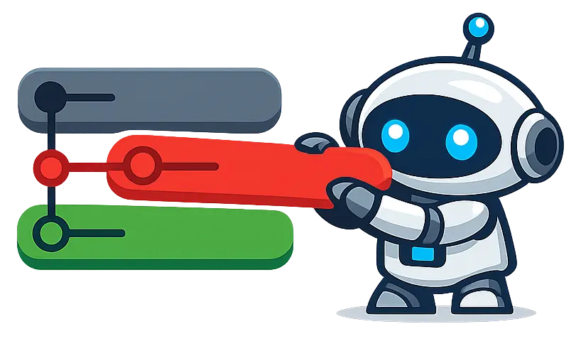

<p align="center">
  
</p>

<h1 align="center">restack</h1>

Rebase stacked PRs onto their current base branches. When you merge a PR that
has another PR stacked on top, `restack` rebases the entire chain automatically.

## Why?

With stacked PRs, merging one PR leaves the next one based on a stale branch.
You have to manually rebase each downstream PR in order. For a stack of three
PRs, that means:

```
git fetch origin
cd worktree-b && git rebase origin/main
git push --force-with-lease
cd worktree-c && git rebase feat-b
git push --force-with-lease
```

With restack:

```
restack
```

It figures out the dependency order, rebases each branch onto its current base,
and pushes.

## Install

```bash
# Shell
curl -fsSL https://raw.githubusercontent.com/raine/restack/main/scripts/install.sh | bash

# Cargo
cargo install restack

# Homebrew
brew install raine/restack/restack
```

## Usage

```
restack [OPTIONS] [PRS]...
```

### Auto-discovery (no arguments)

When run without arguments, restack scans your git worktrees, cross-references
them with open PRs in the repo, and restacks all matching PRs in dependency
order.

```bash
restack
```

```
✔ Fetching open PRs
PR #42: feat-a → main
PR #43: feat-b → feat-a

✔ Fetching origin
✔ PR #42: rebasing 'feat-a' onto 'origin/main'
✔ PR #42: pushing 'feat-a'
✔ PR #43: rebasing 'feat-b' onto 'feat-a'
✔ PR #43: pushing 'feat-b'
All PRs restacked successfully.
```

### Explicit PR numbers

Target specific PRs instead of auto-discovering:

```bash
restack 42 43
```

### Options

- `--dry-run` -- show what would be done without executing
- `--no-push` -- skip pushing branches after rebasing

## How it works

1. **Discovers PRs** -- without arguments, fetches all open PRs (`gh pr list`)
   and matches them against checked-out worktree branches. With arguments, looks
   up each PR individually.
2. **Sorts by dependency** -- topological sort ensures base PRs are rebased
   before their dependents. Detects circular dependencies.
3. **Preflight checks** -- verifies every PR branch is checked out in a
   worktree.
4. **Fetches origin** -- single `git fetch origin` before any rebasing.
5. **Rebases** -- each branch is rebased onto its base. If the base was just
   rebased in this run, it uses the local ref instead of `origin/<base>`. Dirty
   worktrees are handled with `--autostash`.
6. **Pushes** -- force-pushes each branch with `--force-with-lease`.

## Requirements

- [gh](https://cli.github.com/) CLI
- Git 2.0+
- Branches must be checked out in git worktrees

## Related projects

- [workmux](https://github.com/raine/workmux) -- Git worktrees + tmux windows
  for parallel AI agent workflows
- [git-surgeon](https://github.com/raine/git-surgeon) -- Non-interactive
  hunk-level git staging for AI agents
